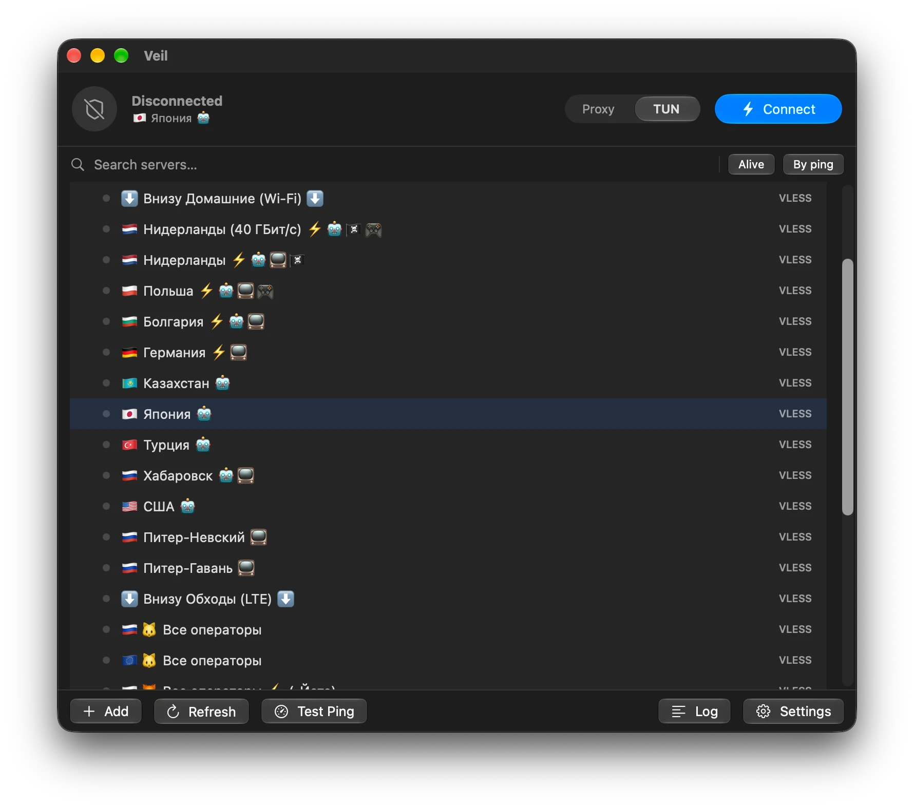

<p align="center">
  
</p>

<h1 align="center">Veil</h1>

<p align="center">
  A fast, native VPN client for macOS.<br>
  Free and open source.
</p>

<p align="center">
  <a href="https://faustyu1.github.io/veil/">Website</a> ·
  <a href="docs/ios.md">Docs</a> ·
  <a href="https://github.com/faustyu1/veil/releases">Download</a> ·
  <a href="https://github.com/faustyu1/veil/issues">Issues</a>
</p>

<p align="center">
  <a href="https://github.com/faustyu1/veil/releases/latest"></a>
  <a href="https://www.gnu.org/licenses/agpl-3.0"></a>
  <a href="https://github.com/faustyu1/veil/actions/workflows/ci.yml"></a>
  
</p>

<p align="center">
  <a href="README.md">English</a> ·
  <a href="README.ru.md">Русский</a>
</p>

<p align="center">
  
</p>

---

Veil is a SwiftUI client for the [Xray-core](https://github.com/XTLS/Xray-core) and
[sing-box](https://github.com/SagerNet/sing-box) proxy engines. It brings a Happ /
v2RayTun-style experience to the Mac: subscription profiles, one-click connect,
full-traffic tunnelling, and v2rayN-grade domain/IP routing — in a menu-bar app that
never asks for your password twice.

> **Disclaimer.** Veil is a client for proxy protocols intended for privacy, development,
> and lawful circumvention of censorship. You are responsible for complying with the laws
> and terms of service that apply to you. The bundled cores are third-party software under
> their own licences.

## Install

Download `Veil.app.zip` from the [latest release](https://github.com/faustyu1/veil/releases/latest),
unzip it, and move **Veil.app** to `/Applications`.

The app is ad-hoc signed, so on first launch right-click → **Open**, or allow it under
**System Settings → Privacy & Security**.

Requires macOS 14 (Sonoma) or later, on Apple Silicon or Intel.

## Features

### Protocols

Two cores, picked automatically per server — you never choose one by hand.

| Core | Protocols | Transports & security |
| --- | --- | --- |
| **Xray-core** | VLESS, VMess, Trojan, Shadowsocks | Reality, TLS, `tcp` / `ws` / `grpc` / `http` / `xhttp`, XTLS `xtls-rprx-vision`, ML-KEM-768 post-quantum encryption |
| **sing-box** | Hysteria2, TUIC, WireGuard, AnyTLS | QUIC-based and modern transports Xray does not speak |

### Two tunnel modes

- **System Proxy** — points the macOS SOCKS/HTTP proxy at Veil. No admin password. Covers
  browsers and proxy-aware apps.
- **TUN (all apps)** — routes *everything* (Telegram, terminal, games, UDP) through
  [tun2socks](https://github.com/xjasonlyu/tun2socks). One privileged-helper install, then
  server switches never prompt again.

### Routing

Presets for **Global**, **Bypass LAN**, **Bypass China**, **Bypass Russia**, and **Custom**,
plus a full ordered rule editor: per-rule outbound (proxy / direct / block), domain and IP
matchers (`domain:`, `geosite:`, `keyword:`, `regexp:`, `geoip:cn`, `geoip:private`), port,
enable/disable and reordering. `geosite.dat` / `geoip.dat` databases download on demand from
Loyalsoldier, runetfreedom, v2fly, or a URL you supply. Ad and tracker blocking is one tap
(`geosite:category-ads-all`).

### Security

- **A privileged helper, not a sudoers rule.** Route, DNS and tunnel changes go through a
  launchd daemon that accepts a fixed set of typed commands from Veil and nothing else. No
  `NOPASSWD` entry, no root-owned shell scripts, no state in `/tmp`.
- **Secrets in the Keychain.** Subscription URLs (whose path *is* the access token) and device
  identifiers live in the Keychain; the rest of the state is a `0600` file in a `0700` directory.
- **Diagnostics you can actually send.** *Settings → Privacy → Export diagnostics* produces a
  report with URLs, tokens and IDs already removed.
- **Pinned cores.** `Scripts/cores.lock` records the version and SHA-256 of every downloaded
  core; the fetch scripts abort on a mismatch.

### Everything else

- **Subscriptions** — each URL becomes its own profile group. Reads `Subscription-Userinfo`
  (traffic & expiry), `Profile-Title` and `Announce` headers. Auto-updates on an interval.
- **QR codes** — show any server as a QR (copy link or save PNG); import by scanning with the
  camera or decoding an image file.
- **Fast switching** — switching servers in the same mode keeps the transport up and only
  restarts the core. Sub-second, no password prompt.
- **Latency testing** — TCP-connect ping per server or per group, with host-route bypass while
  TUN is active. Sort by ping, filter to alive-only, search.
- **Menu-bar control** — connect, disconnect and quick-switch without opening the window.
- **System integration** — launch at login via `SMAppService`, notifications on connect /
  disconnect / reconnect.
- **In-app updates** — checks releases and installs them for you.
- **12 languages** — English, Русский, 中文, Español, हिन्दी, العربية, Français, Português,
  Deutsch, 日本語, Bahasa Indonesia, Türkçe.
- **Safe shutdown** — restores routes and DNS on quit, and recovers from a crashed previous
  session so you are never left without internet.

## Usage

1. **Add servers** — *Subscription* to import a subscription URL, or *Add Link* to paste
   `vless://` / `vmess://` / `trojan://` / `ss://` / `hysteria2://` / `tuic://` / `anytls://` /
   `wireguard://` links, one per line. QR import works from an image file or the camera.
2. **Pick a mode** — *Proxy* for browsers, *TUN* for everything. The first TUN connection
   installs the privileged helper behind a single password prompt. Because Veil is ad-hoc
   signed, the helper pins that exact binary — reinstall it from *Settings* after an update.
3. **Connect** — click a server to select and connect. The connect button and the menu-bar item
   act on the remembered server.
4. **Route** — *Settings → Routing → Configure…*. Pick a preset or build your own rules.

## How it works

```
SwiftUI app (Veil)
 ├─ Xray-core (subprocess)    VLESS/VMess/Trojan/SS — SOCKS + HTTP inbounds on 127.0.0.1
 ├─ sing-box (subprocess)     Hysteria2/TUIC/WireGuard/AnyTLS — same inbounds
 │    └─ your server outbound + direct/block, routing rules (core chosen per server)
 ├─ System Proxy mode         networksetup points the active service at the SOCKS/HTTP ports
 └─ TUN mode                  tun2socks utun device + split-default routes (0/1 + 128/1),
                              server IP pinned to the physical gateway
```

## Build from source

```bash
git clone https://github.com/faustyu1/veil.git && cd veil

Scripts/fetch-xray.sh        # bundled cores, architecture detected automatically
Scripts/fetch-singbox.sh
Scripts/fetch-tun2socks.sh

Scripts/run-app.sh release   # build, package into Veil.app, launch
```

> A plain `swift run` shows no window — macOS needs the `.app` bundle that `run-app.sh`
> assembles (Info.plist, icon, ad-hoc codesign).

```bash
swift test
```

Needs a Swift 6 toolchain (Xcode 16+). See [CONTRIBUTING.md](CONTRIBUTING.md) for the full
development setup, code style and PR checklist.

## iOS

The repository also contains an iPhone/iPad app (`ios/`) built on Apple's **NetworkExtension**,
so all traffic on the device is tunnelled. It ships **Xray-core only** — no tun2socks and no
second core: Xray's own layer-3 `tun` inbound takes the utun descriptor straight from
`NEPacketTunnelProvider`. It shares its entire model and core layer with the Mac app, so
parsers, config builder, subscriptions, routing and localization behave identically.

```bash
Scripts/ios/build-xraycore.sh              # Xray-core -> XrayCore.xcframework
Scripts/ios/build-app.sh simulator Release
```

See **[docs/ios.md](docs/ios.md)** for the packet path, signing requirements and the
app↔extension protocol.

<details>
<summary><b>Why there is no iOS build to download yet</b></summary>

<br>

The tunnel needs the `packet-tunnel-provider` Network Extension entitlement. Apple only issues
that entitlement through a **paid Apple Developer Program membership** ($99/year) — a free
personal team cannot provision it.

**Please don't try to sign the app with an ordinary certificate.** It will not work, and the
failure is confusing rather than obvious:

- Sign it with a free personal team and signing fails outright — the entitlement is rejected,
  because entitlements have to be authorised by a provisioning profile Apple issued.
- Strip the entitlement to make it build and the app installs and launches fine, but the VPN
  never starts: `NETunnelProviderManager` refuses the configuration, and you get an error with
  no obvious cause.

Re-signing tools that rely on free accounts (AltStore, Sideloadly and friends) hit the same
wall, for the same reason — none of them can grant an entitlement Apple has not issued.

So the app is buildable from source by anyone who already has a paid account, but there is no
signed build to hand out until the membership is funded. If you'd like to help:

- **TON** — `UQDsbwQEaspICRDSW4oSNmL0PXxDlnfkiMuqoUbK7ufiCVXj`
- **RUB** — [CloudTips](https://pay.cloudtips.ru/p/a207bf02)

Nothing in the app is paywalled and none of this changes the licence — it stays AGPLv3 either
way. The membership only buys the ability to ship a build that iOS will actually run.

</details>

## Project layout

```
Sources/XrayClient/
  App.swift                 app entry, menu-bar extra, lifecycle
  Models/                   ProxyConfig, Subscription, AppSettings, Routing
  Core/                     link parsing, config builders, cores, tunnel, routing, updates
  Views/                    ContentView, MenuBarContent, SettingsSheet, RoutingSheet, …
  Resources/                xray, sing-box, tun2socks (fetched, not in git)
Sources/VeilHelperKit/      XPC protocol + input validation shared with the helper
Sources/VeilHelper/         the privileged launchd daemon (routes, DNS, tun2socks)
Scripts/                    fetch-*, cores.lock, run-app.sh, make-icon.sh, *-daemon.sh
Tests/                      parsers, link builder, config builders, security, routing
docs/                       ios.md, website
```

## Contributing

Pull requests are welcome. Start with [CONTRIBUTING.md](CONTRIBUTING.md) — it covers the build,
code style, commit format and the PR checklist. By taking part you agree to the
[Code of Conduct](CODE_OF_CONDUCT.md).

## Acknowledgements

- [XTLS/Xray-core](https://github.com/XTLS/Xray-core) — VLESS/VMess/Trojan/SS proxy engine
- [SagerNet/sing-box](https://github.com/SagerNet/sing-box) — Hysteria2/TUIC/WireGuard/AnyTLS engine
- [xjasonlyu/tun2socks](https://github.com/xjasonlyu/tun2socks) — TUN ↔ SOCKS
- Rule databases: [Loyalsoldier/v2ray-rules-dat](https://github.com/Loyalsoldier/v2ray-rules-dat),
  [runetfreedom/russia-v2ray-rules-dat](https://github.com/runetfreedom/russia-v2ray-rules-dat),
  [v2fly](https://github.com/v2fly)

## Star History

<a href="https://star-history.com/#faustyu1/veil&Date">
  <picture>
    <source media="(prefers-color-scheme: dark)" srcset="https://api.star-history.com/svg?repos=faustyu1/veil&type=Date&theme=dark">
    <source media="(prefers-color-scheme: light)" srcset="https://api.star-history.com/svg?repos=faustyu1/veil&type=Date">
    
  </picture>
</a>

## License

Copyright (C) 2026 faustyu1.

Veil is free software, licensed under the **GNU Affero General Public License v3.0** — see
[LICENSE](LICENSE). The bundled cores ([Xray-core](https://github.com/XTLS/Xray-core),
[sing-box](https://github.com/SagerNet/sing-box), [tun2socks](https://github.com/xjasonlyu/tun2socks))
remain under their own licences.
