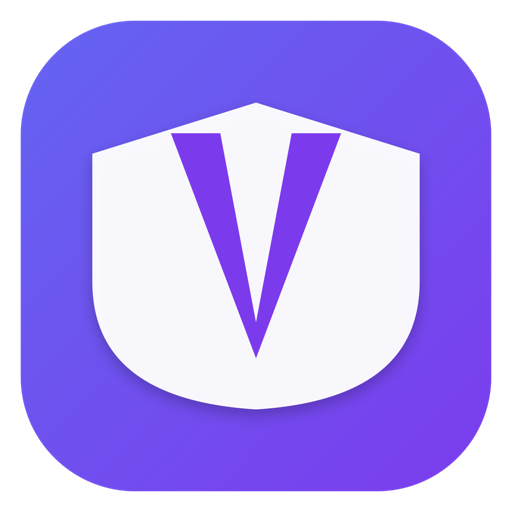
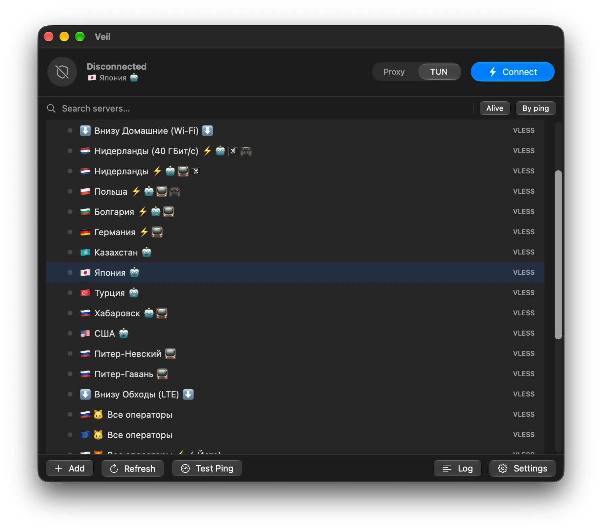

<p align="center">
  
</p>

<h1 align="center">Veil</h1>

<p align="center">
  Быстрый нативный VPN-клиент для macOS.<br>
  Бесплатный и с открытым исходным кодом.
</p>

<p align="center">
  <a href="https://faustyu1.github.io/veil/">Сайт</a> ·
  <a href="docs/ios.md">Документация</a> ·
  <a href="https://github.com/faustyu1/veil/releases">Скачать</a> ·
  <a href="https://github.com/faustyu1/veil/issues">Issues</a>
</p>

<p align="center">
  <a href="https://github.com/faustyu1/veil/releases/latest"></a>
  <a href="https://www.gnu.org/licenses/agpl-3.0"></a>
  <a href="https://github.com/faustyu1/veil/actions/workflows/ci.yml"></a>
  
</p>

<p align="center">
  <a href="README.md">English</a> ·
  <a href="README.ru.md">Русский</a>
</p>

<p align="center">
  
</p>

---

Veil — клиент на SwiftUI для прокси-движков [Xray-core](https://github.com/XTLS/Xray-core) и
[sing-box](https://github.com/SagerNet/sing-box). Он приносит на Mac опыт в духе Happ и
v2RayTun: профили подписок, подключение в один клик, туннелирование всего трафика и
маршрутизация по доменам и IP уровня v2rayN — в приложении из строки меню, которое не просит
пароль дважды.

> **Дисклеймер.** Veil — клиент прокси-протоколов, предназначенный для приватности, разработки
> и законного обхода цензуры. Соблюдение применимых к вам законов и пользовательских соглашений
> остаётся вашей ответственностью. Встроенные ядра — стороннее ПО под собственными лицензиями.

## Установка

Скачайте `Veil.app.zip` из [последнего релиза](https://github.com/faustyu1/veil/releases/latest),
распакуйте и перенесите **Veil.app** в `/Applications`.

Приложение подписано ad-hoc, поэтому при первом запуске нажмите правой кнопкой → **Открыть**
или разрешите запуск в **Системных настройках → Конфиденциальность и безопасность**.

Требуется macOS 14 (Sonoma) или новее, Apple Silicon или Intel.

## Возможности

### Протоколы

Два ядра, которые выбираются автоматически под каждый сервер — вручную выбирать не нужно.

| Ядро | Протоколы | Транспорты и безопасность |
| --- | --- | --- |
| **Xray-core** | VLESS, VMess, Trojan, Shadowsocks | Reality, TLS, `tcp` / `ws` / `grpc` / `http` / `xhttp`, XTLS `xtls-rprx-vision`, постквантовое шифрование ML-KEM-768 |
| **sing-box** | Hysteria2, TUIC, WireGuard, AnyTLS | QUIC и современные транспорты, которых нет в Xray |

### Два режима туннеля

- **Системный прокси** — направляет SOCKS/HTTP-прокси macOS на Veil. Без пароля администратора.
  Работает для браузеров и приложений, умеющих в прокси.
- **TUN (все приложения)** — заворачивает *весь* трафик (Telegram, терминал, игры, UDP) через
  [tun2socks](https://github.com/xjasonlyu/tun2socks). Привилегированный помощник ставится один
  раз, дальше переключение серверов пароль не спрашивает.

### Маршрутизация

Пресеты **Global**, **Bypass LAN**, **Bypass China**, **Bypass Russia** и **Custom**, плюс
полноценный упорядоченный редактор правил: исходящий канал на правило (proxy / direct / block),
совпадения по доменам и IP (`domain:`, `geosite:`, `keyword:`, `regexp:`, `geoip:cn`,
`geoip:private`), порт, включение/выключение и изменение порядка. Базы `geosite.dat` /
`geoip.dat` скачиваются по требованию из Loyalsoldier, runetfreedom, v2fly или по вашей ссылке.
Блокировка рекламы и трекеров включается одним нажатием (`geosite:category-ads-all`).

### Безопасность

- **Привилегированный помощник, а не правило в sudoers.** Изменения маршрутов, DNS и туннеля
  идут через launchd-демон, который принимает от Veil фиксированный набор типизированных команд
  и больше ничего. Ни записи `NOPASSWD`, ни root-скриптов, ни состояния в `/tmp`.
- **Секреты в Keychain.** URL подписок (путь в них *и есть* токен доступа) и идентификаторы
  устройства лежат в Keychain, остальное состояние — файл `0600` в каталоге `0700`.
- **Диагностика, которую не страшно отправить.** *Настройки → Приватность → Экспорт диагностики*
  выдаёт отчёт, из которого URL, токены и идентификаторы уже убраны.
- **Зафиксированные ядра.** `Scripts/cores.lock` хранит версию и SHA-256 каждого скачиваемого
  ядра; скрипты загрузки прерываются при несовпадении.

### Остальное

- **Подписки** — каждый URL становится отдельной группой профилей. Читаются заголовки
  `Subscription-Userinfo` (трафик и срок), `Profile-Title` и `Announce`. Автообновление по
  интервалу.
- **QR-коды** — показать любой сервер как QR (скопировать ссылку или сохранить PNG), добавить
  сервер сканированием камерой или из файла изображения.
- **Быстрое переключение** — смена сервера в том же режиме не рушит транспорт, перезапускается
  только ядро. Меньше секунды, без запроса пароля.
- **Проверка задержки** — TCP-пинг по серверу или по группе, с обходом маршрута при активном
  TUN. Сортировка по пингу, фильтр живых, поиск.
- **Управление из строки меню** — подключение, отключение и быстрая смена сервера без открытия
  окна.
- **Интеграция с системой** — запуск при входе через `SMAppService`, уведомления о подключении,
  отключении и переподключении.
- **Обновления внутри приложения** — проверяет релизы и устанавливает их сам.
- **12 языков** — English, Русский, 中文, Español, हिन्दी, العربية, Français, Português,
  Deutsch, 日本語, Bahasa Indonesia, Türkçe.
- **Безопасное завершение** — возвращает маршруты и DNS при выходе и восстанавливается после
  падения прошлой сессии, так что вы не останетесь без интернета.

## Как пользоваться

1. **Добавьте серверы** — *Subscription*, чтобы импортировать URL подписки, или *Add Link*,
   чтобы вставить ссылки `vless://` / `vmess://` / `trojan://` / `ss://` / `hysteria2://` /
   `tuic://` / `anytls://` / `wireguard://`, по одной в строке. Импорт из QR работает из файла
   и с камеры.
2. **Выберите режим** — *Proxy* для браузеров, *TUN* для всего остального. Первое подключение в
   TUN ставит привилегированный помощник за один запрос пароля. Поскольку Veil подписан ad-hoc,
   помощник привязан к конкретному бинарнику — после обновления переустановите его из
   *Настроек*.
3. **Подключитесь** — клик по серверу выбирает и подключает. Кнопка подключения и пункт в
   строке меню работают с запомненным сервером.
4. **Настройте маршруты** — *Настройки → Маршрутизация → Настроить…*. Возьмите пресет или
   соберите свои правила.

## Как это устроено

```
SwiftUI-приложение (Veil)
 ├─ Xray-core (подпроцесс)    VLESS/VMess/Trojan/SS — SOCKS + HTTP inbound на 127.0.0.1
 ├─ sing-box (подпроцесс)     Hysteria2/TUIC/WireGuard/AnyTLS — те же inbound
 │    └─ ваш outbound + direct/block, правила маршрутизации (ядро выбирается по серверу)
 ├─ Режим системного прокси   networksetup направляет активный сервис на порты SOCKS/HTTP
 └─ Режим TUN                 utun-устройство tun2socks + split-default маршруты (0/1 + 128/1),
                              IP сервера прибит к физическому шлюзу
```

## Сборка из исходников

```bash
git clone https://github.com/faustyu1/veil.git && cd veil

Scripts/fetch-xray.sh        # встроенные ядра, архитектура определяется сама
Scripts/fetch-singbox.sh
Scripts/fetch-tun2socks.sh

Scripts/run-app.sh release   # собрать, упаковать в Veil.app и запустить
```

> Обычный `swift run` окна не покажет — macOS нужен бандл `.app`, который собирает
> `run-app.sh` (Info.plist, иконка, ad-hoc подпись).

```bash
swift test
```

Нужен тулчейн Swift 6 (Xcode 16+). Полная настройка окружения, стиль кода и чек-лист для PR —
в [CONTRIBUTING.md](CONTRIBUTING.md).

## iOS

В репозитории есть и приложение для iPhone и iPad (`ios/`) на **NetworkExtension**, так что
туннелируется весь трафик устройства. В нём **только Xray-core** — ни tun2socks, ни второго
ядра: собственный layer-3 `tun` inbound Xray забирает дескриптор utun прямо из
`NEPacketTunnelProvider`. Оно делит с Mac-приложением весь слой моделей и ядра, поэтому
парсеры, сборщик конфигов, подписки, маршрутизация и локализация ведут себя одинаково.

```bash
Scripts/ios/build-xraycore.sh              # Xray-core -> XrayCore.xcframework
Scripts/ios/build-app.sh simulator Release
```

Путь пакета, требования к подписи и протокол приложение↔расширение — в
**[docs/ios.md](docs/ios.md)**.

<details>
<summary><b>Почему сборки для iOS пока нет</b></summary>

<br>

Туннелю нужен entitlement `packet-tunnel-provider` для Network Extension. Apple выдаёт его
только по **платному членству в Apple Developer Program** ($99 в год) — бесплатная персональная
команда его не провижинит.

**Не пытайтесь подписать приложение обычным сертификатом.** Это не сработает, и отказ выглядит
скорее запутанно, чем очевидно:

- Подпишете бесплатной персональной командой — подпись просто упадёт: entitlement отклонят,
  потому что его должен разрешить профиль, выданный Apple.
- Уберёте entitlement, чтобы собралось, — приложение поставится и запустится, но VPN не
  стартует: `NETunnelProviderManager` отказывается принимать конфигурацию, а ошибка ничего не
  объясняет.

Инструменты переподписи, работающие на бесплатных аккаунтах (AltStore, Sideloadly и прочие),
упираются в ту же стену по той же причине — ни один из них не может выдать entitlement,
которого не выдала Apple.

Так что собрать из исходников может любой, у кого уже есть платный аккаунт, но раздать готовую
подписанную сборку нечем, пока членство не оплачено. Если хотите помочь:

- **TON** — `UQDsbwQEaspICRDSW4oSNmL0PXxDlnfkiMuqoUbK7ufiCVXj`
- **RUB** — [CloudTips](https://pay.cloudtips.ru/p/a207bf02)

Ничего в приложении не закрыто платно, и на лицензию это не влияет — она в любом случае
остаётся AGPLv3. Членство покупает только возможность выпустить сборку, которую iOS реально
запустит.

</details>

## Структура проекта

```
Sources/XrayClient/
  App.swift                 точка входа, пункт в строке меню, жизненный цикл
  Models/                   ProxyConfig, Subscription, AppSettings, Routing
  Core/                     разбор ссылок, сборка конфигов, ядра, туннель, маршруты, обновления
  Views/                    ContentView, MenuBarContent, SettingsSheet, RoutingSheet, …
  Resources/                xray, sing-box, tun2socks (скачиваются, не в git)
Sources/VeilHelperKit/      XPC-протокол и валидация входных данных, общие с помощником
Sources/VeilHelper/         привилегированный launchd-демон (маршруты, DNS, tun2socks)
Scripts/                    fetch-*, cores.lock, run-app.sh, make-icon.sh, *-daemon.sh
Tests/                      парсеры, сборщик ссылок, сборщики конфигов, безопасность, маршруты
docs/                       ios.md, сайт
```

## Участие в разработке

Пулл-реквесты приветствуются. Начните с [CONTRIBUTING.md](CONTRIBUTING.md) — там сборка, стиль
кода, формат коммитов и чек-лист для PR. Участвуя, вы принимаете
[Кодекс поведения](CODE_OF_CONDUCT.md).

## Благодарности

- [XTLS/Xray-core](https://github.com/XTLS/Xray-core) — движок VLESS/VMess/Trojan/SS
- [SagerNet/sing-box](https://github.com/SagerNet/sing-box) — движок Hysteria2/TUIC/WireGuard/AnyTLS
- [xjasonlyu/tun2socks](https://github.com/xjasonlyu/tun2socks) — TUN ↔ SOCKS
- Базы правил: [Loyalsoldier/v2ray-rules-dat](https://github.com/Loyalsoldier/v2ray-rules-dat),
  [runetfreedom/russia-v2ray-rules-dat](https://github.com/runetfreedom/russia-v2ray-rules-dat),
  [v2fly](https://github.com/v2fly)

## История звёзд

<a href="https://star-history.com/#faustyu1/veil&Date">
  <picture>
    <source media="(prefers-color-scheme: dark)" srcset="https://api.star-history.com/svg?repos=faustyu1/veil&type=Date&theme=dark">
    <source media="(prefers-color-scheme: light)" srcset="https://api.star-history.com/svg?repos=faustyu1/veil&type=Date">
    
  </picture>
</a>

## Лицензия

Copyright (C) 2026 faustyu1.

Veil — свободное ПО под лицензией **GNU Affero General Public License v3.0**, см.
[LICENSE](LICENSE). Встроенные ядра ([Xray-core](https://github.com/XTLS/Xray-core),
[sing-box](https://github.com/SagerNet/sing-box), [tun2socks](https://github.com/xjasonlyu/tun2socks))
остаются под своими лицензиями.
